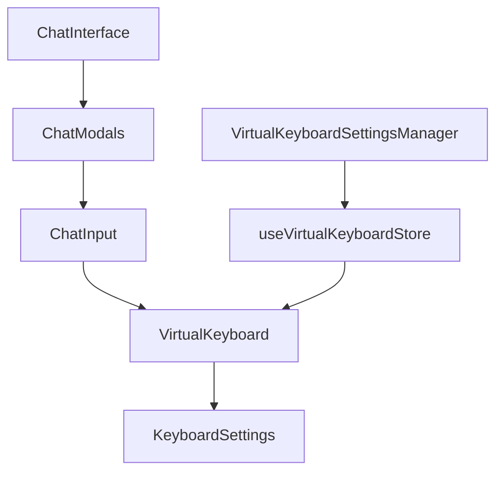

# Custom Virtual Keyboard - Technical Specification

## 1. Overview

This document outlines the technical implementation plan for a customizable, transparent virtual keyboard for mobile view in the SatLoom chat application.

### 1.1 Requirements Summary

| Requirement | Description |
|-------------|-------------|
| Custom Virtual Keyboard | QWERTY layout with numeric/special keys |
| Overlay Design | Transparent, overlays on native keyboard |
| Mobile Only | Only visible on devices < 768px width |
| Customization | Position, size, opacity, theme, text color, text size |
| Settings Persistence | localStorage with prefix `satloom-virtual-keyboard-` |
| Activation | One-click to show/hide |

---

## 2. Component Architecture

### 2.1 Component Structure

```
components/
├── virtual-keyboard/
│   ├── virtual-keyboard.tsx        # Main keyboard component
│   ├── keyboard-settings.tsx       # Settings panel/modal
│   ├── keyboard-key.tsx            # Individual key component
│   ├── keyboard-row.tsx            # Row of keys
│   └── index.ts                    # Barrel export
├── ui/
│   └── (existing components)
```

### 2.2 Component Hierarchy



### 2.3 Component Responsibilities

| Component | Responsibility |
|-----------|----------------|
| [`VirtualKeyboard`](components/virtual-keyboard/virtual-keyboard.tsx:1) | Main keyboard rendering, key layout, input handling |
| [`KeyboardSettings`](components/virtual-keyboard/keyboard-settings.tsx:1) | Customization UI panel |
| [`KeyboardKey`](components/virtual-keyboard/keyboard-key.tsx:1) | Individual key rendering with press states |
| [`KeyboardRow`](components/virtual-keyboard/keyboard-row.tsx:1) | Row container for keys |

---

## 3. Data Structures

### 3.1 Settings Interface

```typescript
interface VirtualKeyboardSettings {
  // Visibility
  isEnabled: boolean;           // Whether custom keyboard is active
  isVisible: boolean;          // Current visibility state
  
  // Position & Size
  position: 'bottom' | 'top';  // Position on screen
  width: number;               // Width percentage (50-100)
  height: number;              // Height in pixels (150-400)
  
  // Appearance
  opacity: number;             // 0-100 percentage
  theme: 'dark' | 'light' | 'transparent';
  backgroundColor: string;     // Hex color
  textColor: string;           // Hex color
  keyTextSize: number;         // Font size in pixels (12-24)
  
  // Keyboard Layout
  layout: 'qwerty' | 'numeric' | 'symbols';
  showNumbersRow: boolean;      // Show numbers on top row
  hapticFeedback: boolean;     // Enable haptic feedback on key press
}
```

### 3.2 Default Settings

```typescript
const DEFAULT_SETTINGS: VirtualKeyboardSettings = {
  isEnabled: false,
  isVisible: false,
  position: 'bottom',
  width: 100,
  height: 220,
  opacity: 95,
  theme: 'transparent',
  backgroundColor: 'rgba(15, 23, 42, 0.85)', // slate-900 with opacity
  textColor: '#ffffff',
  keyTextSize: 16,
  layout: 'qwerty',
  showNumbersRow: true,
  hapticFeedback: true,
};
```

---

## 4. State Management

### 4.1 Zustand Store

Create a new store `stores/virtual-keyboard-store.ts`:

```typescript
import { create } from 'zustand';
import { persist } from 'zustand/middleware';
import type { VirtualKeyboardSettings } from '@/components/virtual-keyboard/types';

interface VirtualKeyboardState extends VirtualKeyboardSettings {
  // Actions
  toggleEnabled: () => void;
  toggleVisibility: () => void;
  setPosition: (position: 'bottom' | 'top') => void;
  setWidth: (width: number) => void;
  setHeight: (height: number) => void;
  setOpacity: (opacity: number) => void;
  setTheme: (theme: 'dark' | 'light' | 'transparent') => void;
  setBackgroundColor: (color: string) => void;
  setTextColor: (color: string) => void;
  setKeyTextSize: (size: number) => void;
  setLayout: (layout: 'qwerty' | 'numeric' | 'symbols') => void;
  setShowNumbersRow: (show: boolean) => void;
  setHapticFeedback: (enabled: boolean) => void;
  resetToDefaults: () => void;
}
```

### 4.2 Settings Persistence

```typescript
// Storage key pattern: satloom-virtual-keyboard-{setting}
// Using zustand persist middleware with custom storage

const storage = {
  getItem: (name: string) => {
    const value = localStorage.getItem(`satloom-virtual-keyboard-${name}`);
    return value ? JSON.parse(value) : null;
  },
  setItem: (name: string, value: any) => {
    localStorage.setItem(`satloom-virtual-keyboard-${name}`, JSON.stringify(value));
  },
  removeItem: (name: string) => {
    localStorage.removeItem(`satloom-virtual-keyboard-${name}`);
  },
};
```

---

## 5. Keyboard Layout

### 5.1 QWERTY Layout (Default)

```
Row 1: 1 2 3 4 5 6 7 8 9 0 - ← (backspace)
Row 2: Q W E R T Y U I O P
Row 3:  A S D F G H J K L 
Row 4: ⇧ Z X C V B N M ⌨ (switch to symbols)
Row 5: 123 , .  (space)  .com  (enter)
```

### 5.2 Numeric Layout

```
Row 1: 1 2 3 4 5 6 7 8 9 0
Row 2: - / : ; ( ) $ & @ "
Row 3: #+=  . , ? ! '  ← 
Row 4: ABC  . , ? ! '  ←
Row 5: 123 (space)  return
```

### 5.3 Symbol Layout

```
Row 1: [ ] { } # % ^ * + =
Row 2: _ \ | ~ < > € £ ¥ •
Row 3: 123  . , ? ! '  ←
Row 4: ABC  . , ? ! '  ←
Row 5: 123 (space)  return
```

---

## 6. Integration Points

### 6.1 Chat Input Integration

The virtual keyboard will integrate with [`ChatInput`](components/chat/chat-input.tsx:45) by:

1. **Adding toggle button** - Add a keyboard icon button in the mobile input row (line 363-424)
2. **Focus management** - Prevent native keyboard from appearing when custom keyboard is active
3. **Input synchronization** - Sync typed text between custom keyboard and input field

```typescript
// In ChatInput component (mobile section)
<Button
  variant="ghost"
  size="icon"
  className="h-10 w-10 rounded-full bg-slate-700 text-gray-300"
  onClick={() => toggleVirtualKeyboard()}
>
  <Keyboard className="w-5 h-5" />
</Button>
```

### 6.2 Mobile Detection

Use existing [`useIsMobile`](components/ui/use-mobile.tsx:5) hook to ensure keyboard only renders on mobile:

```typescript
const isMobile = useIsMobile();

// Only render on mobile devices
if (!isMobile) return null;
```

### 6.3 Native Keyboard Detection

Detect native keyboard to position overlay correctly:

```typescript
// Use visual viewport API to detect native keyboard
useEffect(() => {
  const handleResize = () => {
    const keyboardHeight = window.innerHeight - visualViewport.height;
    setNativeKeyboardHeight(keyboardHeight);
  };
  
  visualViewport?.addEventListener('resize', handleResize);
  return () => visualViewport?.removeEventListener('resize', handleResize);
}, []);
```

---

## 7. Settings UI Flow

### 7.1 Settings Panel

The customization panel should be accessible via:

1. **Gear icon** in keyboard header (when visible)
2. **Long press** on keyboard area
3. **Chat settings menu** option

### 7.2 Customization Options

| Category | Options | UI Control |
|----------|---------|-------------|
| Position | Bottom / Top | Segmented control |
| Size | Width (50-100%) / Height (150-400px) | Dual sliders |
| Opacity | 50-100% | Slider |
| Theme | Dark / Light / Transparent | Radio buttons |
| Text Color | Color picker | Color input |
| Text Size | 12-24px | Slider |
| Layout | QWERTY / Numeric / Symbols | Segmented control |

### 7.3 Preview

- Real-time preview as settings change
- Mini keyboard preview in settings panel

---

## 8. UI/UX Specifications

### 8.1 Keyboard Container

```tsx
<div 
  className="fixed left-0 right-0 z-[100] transition-all duration-200"
  style={{
    bottom: nativeKeyboardHeight > 0 ? `${nativeKeyboardHeight}px` : '0px',
    height: `${settings.height}px`,
    opacity: settings.opacity / 100,
    backgroundColor: settings.backgroundColor,
  }}
>
  {/* Header with settings toggle */}
  <div className="flex items-center justify-between px-2 py-1">
    <span className="text-xs text-gray-400">Custom Keyboard</span>
    <Button size="icon" variant="ghost" onClick={openSettings}>
      <Settings className="w-4 h-4" />
    </Button>
  </div>
  
  {/* Keyboard rows */}
  {rows.map((row, index) => (
    <KeyboardRow key={index} keys={row} />
  ))}
</div>
```

### 8.2 Key Styling

```tsx
// Key component styles based on theme
const keyStyles = {
  dark: {
    bg: 'bg-slate-700',
    text: 'text-white',
    pressed: 'bg-slate-600',
  },
  light: {
    bg: 'bg-gray-200',
    text: 'text-gray-900',
    pressed: 'bg-gray-300',
  },
  transparent: {
    bg: 'bg-slate-800/60',
    text: 'text-white',
    pressed: 'bg-slate-700/80',
  },
};
```

### 8.3 Animations

- **Show/Hide**: Slide up from bottom (200ms ease-out)
- **Key press**: Scale down to 0.95 (50ms)
- **Settings panel**: Slide in from right (250ms ease-out)

---

## 9. Accessibility

### 9.1 Requirements

- All keys must have `aria-label` with key value
- Support for screen readers (VoiceOver/TalkBack)
- Keyboard navigation support (Tab, Enter, Escape)
- High contrast mode support

### 9.2 Implementation

```tsx
<button
  aria-label={`Key ${keyValue}, row ${rowIndex + 1}`}
  role="gridcell"
  tabIndex={0}
  onKeyDown={handleKeyNavigation}
  className="focus:ring-2 focus:ring-cyan-500"
>
  {displayValue}
</button>
```

---

## 10. Implementation Tasks

### Phase 1: Core Keyboard

1. [ ] Create VirtualKeyboard component with basic QWERTY layout
2. [ ] Add key press handling and input sync
3. [ ] Implement show/hide toggle
4. [ ] Add mobile-only visibility guard

### Phase 2: Customization

1. [ ] Create Zustand store with settings
2. [ ] Implement localStorage persistence
3. [ ] Build settings panel UI
4. [ ] Add position/size/opacity controls

### Phase 3: Themes & Polish

1. [ ] Implement theme system (dark/light/transparent)
2. [ ] Add text color and size customization
3. [ ] Add numeric and symbol layouts
4. [ ] Implement haptic feedback
5. [ ] Add animations and transitions

### Phase 4: Integration

1. [ ] Integrate with ChatInput component
2. [ ] Add keyboard toggle button to mobile input
3. [ ] Handle native keyboard detection
4. [ ] Test and fix edge cases

---

## 11. File Locations Summary

| File | Path | Description |
|------|------|-------------|
| Types | `components/virtual-keyboard/types.ts` | TypeScript interfaces |
| Store | `stores/virtual-keyboard-store.ts` | Zustand state management |
| Main Component | `components/virtual-keyboard/virtual-keyboard.tsx` | Keyboard UI |
| Settings Panel | `components/virtual-keyboard/keyboard-settings.tsx` | Customization UI |
| Key Component | `components/virtual-keyboard/keyboard-key.tsx` | Individual key |
| Row Component | `components/virtual-keyboard/keyboard-row.tsx` | Key row |
| Barrel Export | `components/virtual-keyboard/index.ts` | Module exports |

---

## 12. Dependencies

No new dependencies required. Uses existing:
- `zustand` for state management
- `lucide-react` for icons (already in use)
- `tailwindcss` for styling (already configured)
- `clsx`/`tailwind-merge` for class management (already in use)

---

## 13. Considerations

### 13.1 Performance
- Memoize keyboard rows to prevent unnecessary re-renders
- Use CSS transforms for animations (GPU accelerated)
- Lazy load settings panel

### 13.2 Browser Compatibility
- Test on iOS Safari and Android Chrome
- Handle `visualViewport` API fallbacks
- Test localStorage availability

### 13.3 Edge Cases
- Handle orientation changes
- Handle keyboard appearing/disappearing during typing
- Handle settings reset on app clear
- Prevent keyboard from blocking chat messages
