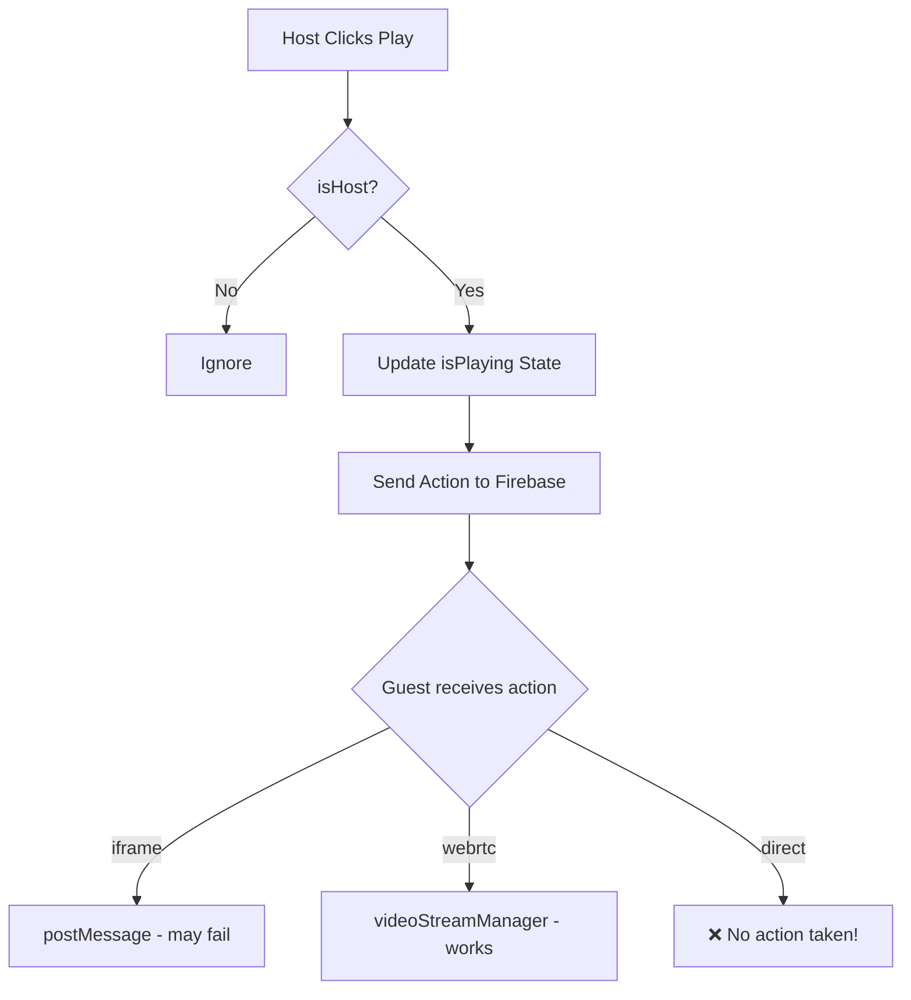
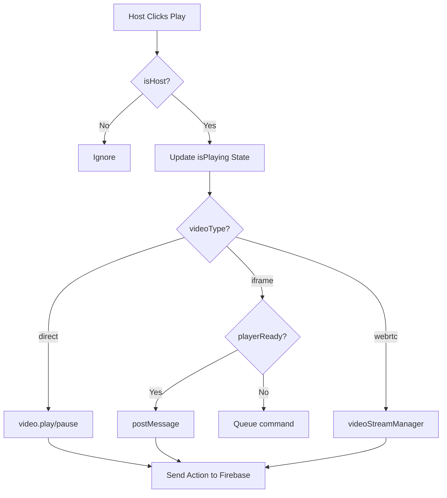

# Video Playback Control - Technical Specification

## Executive Summary

This document outlines the technical analysis and proposed fixes for video playback synchronization issues in the SatLoom Theater mode. The issues span multiple categories: native video control, iframe-based platform control, mic indicator state, and host persistence.

---

## 1. Current Architecture Overview

### Video Types Supported
```
"direct" | "youtube" | "vimeo" | "twitch" | "dailymotion" | "archive" | "soundcloud" | "webrtc"
```

### Key Files
- **Main Component**: [`components/theater-fullscreen.tsx`](components/theater-fullscreen.tsx)
- **Signaling System**: [`utils/infra/theater-signaling.ts`](utils/infra/theater-signaling.ts)
- **Video Stream Manager**: [`utils/hardware/video-stream-manager.ts`](utils/hardware/video-stream-manager.ts)

---

## 2. Issue Analysis & Root Causes

### 2.1 Native Video ("direct") Not Controllable

**Problem**: When host clicks play/pause on direct video, the video doesn't actually play/pause.

**Root Cause**: In [`handlePlay()`](components/theater-fullscreen.tsx:641), the code only handles `"webrtc"` video type:
```typescript
if (session.videoType === "webrtc" && videoStreamManagerRef.current) {
  videoStreamManagerRef.current.syncPlayback(newIsPlaying ? 'play' : 'pause')
}
// ❌ Missing: direct video type handling - no video.play() or video.pause() calls!
```

**Fix Required**: Add native video element control in `handlePlay()`:
```typescript
if (session.videoType === "direct" && videoRef.current) {
  if (newIsPlaying) {
    videoRef.current.play().catch(console.error)
  } else {
    videoRef.current.pause()
  }
}
```

### 2.2 Native Video Seek Not Working

**Problem**: Cannot forward/backward with direct video.

**Root Cause**: In [`handleSeek()`](components/theater-fullscreen.tsx:679), only iframe players get synced:
```typescript
syncIframePlayer("seek", newTime)  // Only syncs iframes
// ❌ Missing: Native video sync!
```

**Fix Required**: Add native video seek in `handleSeek()`:
```typescript
if (session.videoType === "direct" && videoRef.current) {
  videoRef.current.currentTime = newTime
}
```

### 2.3 YouTube Auto-play Issue

**Problem**: Video automatically starts playing, but once paused, it becomes controllable.

**Root Cause**: In [`getEmbedUrl()`](components/theater-fullscreen.tsx:572), YouTube embed has `autoplay=1`:
```typescript
return match ? `https://www.youtube.com/embed/${match[1]}?enablejsapi=1&autoplay=1&controls=0&...`
```

**Fix Required**: Change to `autoplay=0` or handle initial state properly:
```typescript
return match ? `https://www.youtube.com/embed/${match[1]}?enablejsapi=1&autoplay=0&controls=0&...`
```

### 2.4 Vimeo Forward/Backward Not Working

**Problem**: Cannot seek forward/backward on Vimeo.

**Root Cause**: The postMessage API for Vimeo requires proper API initialization. Current implementation in [`syncIframePlayer()`](components/theater-fullscreen.tsx:618):
```typescript
const msg = action === 'play' ? '{"method":"play"}' :
  action === 'pause' ? '{"method":"pause"}' :
    `{"method":"seekTo","value":${time}}`
iframe.contentWindow?.postMessage(msg, '*')
```

**Issues**:
1. No player ready state check before sending commands
2. Vimeo requires `api=1` parameter which is present, but needs `onReady` callback handling

**Fix Required**: 
1. Listen for Vimeo `ready` event via postMessage
2. Only send commands after player is ready
3. Add proper iframe load listener

### 2.5 Archive.org Not Controllable

**Problem**: Archive.org videos cannot be controlled at all.

**Root Cause**: Archive.org embed doesn't expose a proper JavaScript API for controlling playback. The embed is a simple iframe without postMessage communication capability.

**Current Implementation**:
```typescript
if (type === "archive") {
  if (url.includes("/details/")) {
    return url.replace("/details/", "/embed/")
  }
  // ... more cases
}
```

**Fix Options**:
1. **Limited Support**: Accept that archive.org has no seeking capability - display warning to users
2. **Alternative**: Use archive.org's JSON API to get direct video file URLs and use native video player instead of iframe

### 2.6 SoundCloud Not Controllable

**Problem**: SoundCloud cannot be controlled.

**Root Cause**: The SoundCloud widget API requires:
1. Using the SoundCloud Widget SDK
2. Establishing a connection via `SC.Widget(iframe)`
3. Using the widget's methods (`play()`, `pause()`, `seekTo()`)

**Current Implementation** uses simple postMessage which doesn't work with SoundCloud widget.

**Fix Required**: Implement proper SoundCloud Widget integration:
```typescript
// Need to load and initialize the widget
const scWidget = new SC.Widget(iframeRef.current)
scWidget.play()  // Instead of postMessage
```

### 2.7 Twitch/Dailymotion Control Issues

**Problem**: These platforms sync on load but active control via postMessage is missing or unreliable.

**Root Cause**: 
1. No player ready state checks
2. Commands sent before iframe loads are ignored
3. No error handling for failed commands

**Fix Required**: Add player ready state management:
```typescript
const [playerReady, setPlayerReady] = useState({
  youtube: false,
  vimeo: false,
  twitch: false,
  dailymotion: false,
  soundcloud: false
})
```

### 2.8 Mic Indicator Showing "ON" Without User Action

**Problem**: The mic indicator shows as ON even when mic isn't being used.

**Root Cause**: In [`theater-fullscreen.tsx`](components/theater-fullscreen.tsx:65):
```typescript
const [isMicMuted, setIsMicMuted] = useState(true)  // Initial state is true (muted)
```

And in the UI at line 1195:
```typescript
{isMicMuted ? <MicOff className="w-4 h-4 sm:w-5 sm:h-5" /> : <Mic className="w-4 h-4 sm:w-5 sm:h-5" />}
```

**Investigation Needed**: The logic seems correct (`isMicMuted=true` shows `MicOff`). However, there may be:
1. A state synchronization issue
2. The presence system showing incorrect status
3. A visual rendering issue

**Fix Required**: 
1. Add console logging to track actual mic stream state
2. Verify presence system doesn't override the indicator
3. Check if initial stream setup enables mic by default

### 2.9 Host Control Not Working (Host's Player Not Controlled)

**Problem**: The host's player controls are not responding to host's clicks.

**Root Cause**: This is a combination of:
1. Missing native video play/pause calls (Issue 2.1)
2. Missing native video seek (Issue 2.2)
3. Iframe players not receiving postMessage correctly

**Comprehensive Fix**: Address all above issues plus add player ready state management.

### 2.10 Host Persistence - No Host Handover

**Problem**: If host's tab crashes, room loses its "clock" - no automatic host transfer.

**Current State**: [`transferHost()`](utils/infra/theater-signaling.ts:182) exists but is not used:
```typescript
async transferHost(roomId: string, sessionId: string, newHostId: string, newHostName: string) {
  // Implementation exists but not called automatically
}
```

**Fix Required**: Implement automatic host handover:
1. Monitor host presence via Firebase or WebSocket
2. Detect when host disconnects (timeout/close event)
3. Automatically transfer host to longest-connected guest
4. Update playback state from saved `currentTime`

---

## 3. Proposed Solution Architecture

### 3.1 Video Control Strategy Matrix

| Platform | Play/Pause | Seek | Notes |
|----------|------------|------|-------|
| Direct | ✅ Native API | ✅ Native API | Needs code fix |
| YouTube | ⚠️ postMessage | ⚠️ postMessage | Needs ready check |
| Vimeo | ⚠️ postMessage | ⚠️ postMessage | Needs ready check + API |
| Twitch | ⚠️ postMessage | ❌ | No seek API available |
| Dailymotion | ⚠️ postMessage | ⚠️ postMessage | Needs ready check |
| SoundCloud | ❌ | ❌ | Needs Widget SDK |
| Archive.org | ❌ | ❌ | No API available |
| WebRTC | ✅ Stream API | ✅ Stream API | Working |

### 3.2 Implementation Plan

#### Phase 1: Critical Native Video Fixes
1. Add `video.play()` and `video.pause()` in `handlePlay()`
2. Add native video seek in `handleSeek()`
3. Fix YouTube autoplay

#### Phase 2: Iframe Platform Improvements  
1. Add player ready state tracking
2. Add postMessage listener for player ready events
3. Queue commands until player is ready

#### Phase 3: Platform-Specific Solutions
1. Implement SoundCloud Widget SDK
2. Document Archive.org limitations
3. Add warning UI for unsupported platforms

#### Phase 4: Host Persistence
1. Add host presence monitoring
2. Implement automatic host handover
3. Restore playback state after handover

#### Phase 5: Mic Indicator Fix
1. Debug actual mic stream state
2. Fix state synchronization

---

## 4. Mermaid: Current vs Fixed Flow

### Current Flow (Broken)


### Fixed Flow


---

## 5. Key Code Changes Required

### 5.1 Fix handlePlay() - Add Native Video Control
```typescript
// In components/theater-fullscreen.tsx, around line 661
if (session.videoType === "direct" && videoRef.current) {
  if (newIsPlaying) {
    videoRef.current.play().catch(console.error)
  } else {
    videoRef.current.pause()
  }
}
```

### 5.2 Add Player Ready State
```typescript
// Add new state
const [iframePlayersReady, setIframePlayersReady] = useState<Record<string, boolean>>({})

// Add message listener for iframe ready events
useEffect(() => {
  const handleMessage = (event: MessageEvent) => {
    if (event.data === 'ready') {
      setIframePlayersReady(prev => ({ ...prev, [session.videoType]: true }))
    }
  }
  window.addEventListener('message', handleMessage)
  return () => window.removeEventListener('message', handleMessage)
}, [session.videoType])
```

### 5.3 Fix YouTube Autoplay
```typescript
// In getEmbedUrl(), change autoplay=1 to autoplay=0
return match ? `https://www.youtube.com/embed/${match[1]}?enablejsapi=1&autoplay=0&controls=0&...`
```

### 5.4 Implement Host Handover
```typescript
// In theater-signaling.ts or new hook
useEffect(() => {
  const hostRef = ref(getFirebaseDatabase(), `rooms/${roomId}/theater/${sessionId}/hostId`)
  const unsubscribe = onValue(hostRef, (snapshot) => {
    if (!snapshot.exists()) {
      // Host left - initiate handover
      initiateHostHandover()
    }
  })
  return unsubscribe
}, [roomId, sessionId])

async function initiateHostHandover() {
  // Get all participants, find longest connected
  // Call transferHost()
  // Sync playback state to new host
}
```

---

## 6. Testing Checklist

- [ ] Direct video: Play/Pause works
- [ ] Direct video: Seek forward/backward works
- [ ] YouTube: Auto-play disabled by default
- [ ] YouTube: Play/Pause works after click
- [ ] Vimeo: Play/Pause works
- [ ] Vimeo: Seek works
- [ ] Twitch: Play/Pause works
- [ ] Dailymotion: Play/Pause works
- [ ] SoundCloud: Needs widget integration
- [ ] Archive.org: Document as unsupported
- [ ] Mic indicator: Shows correct state
- [ ] Host handover: Automatic on disconnect

---

## 7. Limitations & Known Issues

### Cannot Be Fixed (Platform Limitations)
- **Archive.org**: No JavaScript API available for iframe control
- **Twitch**: No seeking capability via player API
- **SoundCloud**: Requires full Widget SDK integration (not just postMessage)

### Workarounds
1. For Archive.org: Use direct video URL extraction from archive.org metadata API
2. For SoundCloud: Implement full SC.Widget integration
3. For Twitch: Accept no seeking, only play/pause

---

## 8. Files to Modify

| File | Changes |
|------|---------|
| `components/theater-fullscreen.tsx` | Main fixes: handlePlay, handleSeek, getEmbedUrl, player ready state |
| `utils/infra/theater-signaling.ts` | Add host presence monitoring hook |
| `components/theater-setup-modal.tsx` | Add warnings for unsupported platforms |

---

## 9. Priority Recommendation

1. **P0 (Critical)**: Fix native video control - affects all direct video uploads
2. **P0 (Critical)**: Fix YouTube autoplay - breaks user experience
3. **P1 (High)**: Add player ready state - improves iframe platform reliability  
4. **P2 (Medium)**: Implement host handover - production stability
5. **P3 (Low)**: SoundCloud/Archive.org - require significant work for limited benefit

---

*Document Version: 1.0*  
*Last Updated: 2026-03-12*  
*Author: SatLoom Technical Team*
